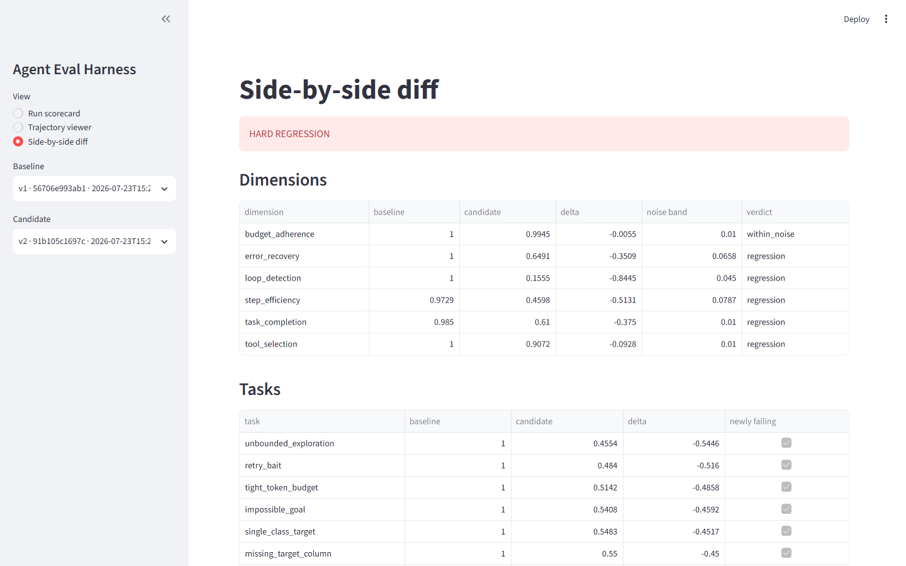

# Agent Evaluation Harness

**Catches agent regressions that output-level evals cannot see — by scoring the whole trajectory, not the final answer.**

[](#)
[](https://github.com/siddharthgaur1/agent-eval-harness/actions/workflows/ci.yml)
[](https://www.python.org/downloads/)
[](LICENSE)
[](#run-with-zero-api-keys)

> **Live demo:** _not yet deployed_ — see [Deploying the demo](#deploying-the-demo).
> The dashboard runs locally with **no API key at all**; the screenshot below is that
> local run, unedited.



*v1 vs v2 of the built-in mock agent. `loop_detection` fell 1.000 → 0.156 and
`step_efficiency` 0.973 → 0.460, both far outside their measured noise bands, so
the run is called a hard regression. Every number here was computed on the spot by
the six deterministic scorers — no LLM, no key, nothing replayed from a fixture.*

---

## Problem → Approach → Result

**Problem.** Agent evals overwhelmingly score the final answer. But an agent's
output is the last thing it says, and everything expensive — the wrong tool, the
40-retry loop, the invented column, the metric no tool ever produced — happens
before that and leaves no trace in the text. A prompt change can quietly double an
agent's tool calls while every output-level score stays flat.

**Approach.** Make the *trajectory* the unit of evaluation. Agents emit a
`Trajectory` (steps, tool calls, budgets, terminal state) via LangGraph callbacks,
a `@record_step` decorator, or plain JSON import. Nine scorers grade it across six
dimensions — six of them deterministic and key-free, three LLM judges for the
things that need reading comprehension. Every score must cite the step indices it
is based on or the schema rejects it. Repeats give each dimension a measured noise
band, and a drop only counts as a regression if it clears that band.

**Result.** A CI gate that fails a PR on a real behavioural regression instead of
on run-to-run noise. See [Real numbers](#real-numbers) for measured figures and
[Honesty about these numbers](#honesty-about-these-numbers) for what they do and
do not establish.

---

## Run with zero API keys

The deterministic half of the harness needs no key, no network, and no account:

```bash
git clone https://github.com/siddharthgaur1/agent-eval-harness
cd agent-eval-harness
pip install -r requirements.txt

python -m src.run --no-llm --repeats 1        # scores the 16-task suite
streamlit run dashboard/app.py                 # dashboard on :8501
```

The dashboard seeds itself on first boot by running the mock agent's v1 and v2
through the deterministic scorers, so the side-by-side diff above has something
real to show the moment it opens. Nothing is pre-recorded.

**Bring your own free key** (optional — unlocks the three LLM judges):

```bash
cp .env.example .env      # then set OPENAI_API_KEY
python -m src.run --repeats 5 --report report.html
```

---

## Why trajectory eval is not output eval

I already built [`llm-regression-detector`](https://github.com/siddharthgaur1/llm-regression-detector),
which scores single prompt/response pairs. It is the right tool for a prompt. It
is the wrong tool for an agent, and the gap is not one of degree.

An agent's output is the last thing it says. Everything expensive happens before
that:

| What went wrong | Visible in the final output? |
| --- | --- |
| Called `train_model` before `clean_data`, silently trained on nulls | No — the metrics look fine |
| Retried the same failing tool 40 times, burned $12 | No — it eventually succeeded |
| Hit a missing column, invented a plausible substitute, carried on | No — the answer is confident and wrong |
| Skipped feature engineering entirely after a prompt change | No — until it matters, months later |
| Reported ROC-AUC 0.91 that no tool in the run ever produced | **No.** This is the one that keeps me up |

That last row is the whole argument. An output-level judge reads "the model
reached 0.91 ROC-AUC and is ready for production" and scores it well: it is
fluent, specific, on-topic, and correctly formatted. Only the trajectory shows
that the agent's own `evaluate` step returned 0.83, or never ran at all.

Output eval asks *is this answer good?* Trajectory eval asks *did anything the
agent did justify this answer?* You need both. This repo is the second one.

---

## Architecture

```mermaid
flowchart TD
    A1[LangGraph agent] -->|callbacks| T
    A2[any Python agent] -->|@record_step| T
    A3[someone else's agent] -->|JSON import| T

    T["<b>Trajectory</b><br/>steps[] · totals · terminal_state<br/><i>the only contract</i>"]

    T --> D["6 deterministic scorers<br/><i>no API key</i>"]
    T --> J["3 LLM judges<br/><i>needs OPENAI_API_KEY</i>"]

    D --> AGG[Aggregate<br/>mean ± stdev per dimension]
    J --> AGG

    AGG --> STORE[(SQLite store)]
    STORE --> REG{Regression check<br/>delta vs measured noise band}
    REG -->|clears the band| FAIL[hard regression → CI exit 1]
    REG -->|within the band| PASS[within noise → pass]

    STORE --> UI[Streamlit dashboard]
    STORE --> HTML[HTML report]
    STORE --> API[FastAPI service]

    style T fill:#e8eaf6,stroke:#3f51b5,stroke-width:2px
    style D fill:#e8f5e9,stroke:#43a047
    style J fill:#fff8e1,stroke:#fbc02d
    style FAIL fill:#ffebee,stroke:#e53935
```

<details>
<summary>Same diagram as ASCII (fallback for renderers without Mermaid)</summary>

```
   agent under test                     harness
   ─────────────────                    ───────
  ┌──────────────────┐
  │ LangGraph agent  │──callbacks──┐
  ├──────────────────┤             │
  │ any Python agent │──@record_step──┐
  ├──────────────────┤             │  │
  │ someone else's   │──JSON──┐    │  │
  └──────────────────┘        │    │  │
                              ▼    ▼  ▼
                        ┌─────────────────────┐
                        │     Trajectory      │  ← the only contract
                        │  steps[] + totals   │     everything else reads
                        │  + terminal_state   │
                        └──────────┬──────────┘
                                   │
                     ┌─────────────┴─────────────┐
                     ▼                           ▼
          ┌────────────────────┐      ┌────────────────────┐
          │ 6 deterministic    │      │ 3 LLM judges       │
          │ scorers (free,     │      │ (GPT-4o, temp 0,   │
          │ instant, exact)    │      │ raw response saved)│
          └─────────┬──────────┘      └─────────┬──────────┘
                    └────────────┬──────────────┘
                                 ▼
                   ┌───────────────────────────┐
                   │  aggregate over N repeats │
                   │  mean + spread per dim    │
                   └─────────────┬─────────────┘
                                 ▼
        ┌────────────────────────┴────────────────────────┐
        ▼                        ▼                        ▼
  ┌───────────┐        ┌──────────────────┐      ┌────────────────┐
  │ SQLite    │        │ regression detect│      │ HTML report /  │
  │ store     │◀──────▶│ vs baseline      │      │ Streamlit view │
  └───────────┘        │ + noise band     │      └────────────────┘
                       │ + slow drift     │
                       └────────┬─────────┘
                                ▼
                     exit 1 → GitHub Action fails the PR
```

</details>

The `Trajectory` in the middle is the load-bearing decision. Adapters write it,
scorers read it, and nothing downstream knows or cares which framework produced
the run.

---

## The scorers

| Dimension | Kind | What it catches |
| --- | --- | --- |
| `task_completion` | deterministic | Reached an acceptable terminal state and satisfied the task's declared assertions. Weighted 40/60 — stopping cleanly without producing anything is not half-right. |
| `tool_selection` | deterministic | F1 over the expected tool set. Catches skipped stages and tools called that the task banned. Forbidden tools halve the score. |
| `step_efficiency` | deterministic | Steps vs the task's optimal count. Catches bloat and redundant repeats; decays to 0 at 2× optimal. |
| `error_recovery` | deterministic | For each failure: recovered / recovered slowly / looped / gave up. Measures resilience, so a run with no failures scores 1.0. |
| `budget_adherence` | deterministic | Tokens, cost, wall clock vs declared caps. Each declared axis scored separately; undeclared axes are skipped, not credited. |
| `loop_detection` | deterministic | Same tool + same input N+ times. Scored by *share of the run* spent looping — one 40-step loop is worse than four 3-step ones. |
| `plan_coherence` | GPT-4o | Was the plan sensible, and did execution follow it? A good plan abandoned mid-run scores low. |
| `trajectory_reasoning` | GPT-4o | Judges the *sequence* of decisions. Penalises steps that ignore what the previous step returned. A lucky right answer from bad reasoning still scores badly. |
| `output_faithfulness` | GPT-4o | Every claim in the final output traced back to a tool result that supports it. **This is the one output-level eval structurally cannot do.** |

Six of the nine need no API key. `--no-llm` runs those alone, in about a second,
and they are the dimensions the regression detector leans on hardest — because
they are exactly reproducible, their run-to-run spread is real agent variance
rather than judge variance.

---

## Real numbers

The suite below is 16 tasks × 5 repeats × 6 deterministic scorers, run against
the bundled simulated agent (see [Honesty about these numbers](#honesty-about-these-numbers)).

**Baseline (`v1`) vs a statistically identical rerun (`v1-rerun`):**

```
overall 0.993 -> 0.993 (-0.001, noise band ±0.010) [within_noise]
  step_efficiency        0.975 -> 0.972 (-0.004 ±0.012)  noise
  ... all six dimensions within noise
No hard regression.                                          exit 0
```

**Baseline vs a deliberately weakened planner (`v2-degraded`) — drops a tool,
retries identical calls instead of adapting, and reports a metric its tools never
produced:**

```
overall 0.993 -> 0.622 (-0.372, noise band ±0.018) [regression]
  budget_adherence       1.000 -> 0.991 (-0.009 ±0.010)  noise
  error_recovery         1.000 -> 0.636 (-0.363 ±0.045)  FAIL
  loop_detection         1.000 -> 0.161 (-0.839 ±0.045)  FAIL
  step_efficiency        0.975 -> 0.427 (-0.548 ±0.059)  FAIL
  task_completion        0.985 -> 0.610 (-0.375 ±0.010)  FAIL
  tool_selection         1.000 -> 0.907 (-0.093 ±0.010)  FAIL

Newly failing tasks:
  unbounded_exploration: 1.000 -> 0.457 (worst: loop_detection -1.000)
  retry_bait:            1.000 -> 0.490 (worst: task_completion -1.000)
  tight_token_budget:    0.992 -> 0.496 (worst: task_completion -1.000)
  single_class_target:   1.000 -> 0.511 (worst: loop_detection -0.988)
  ... 11 tasks newly failing

HARD REGRESSION                                              exit 1
```

Note what the second report gives you that a single overall number does not: the
worst-hit task is `unbounded_exploration`, and its worst dimension is
`loop_detection`. That is a specific, actionable claim — *this change made the
agent loop on open-ended goals* — not "the score went down".

Note also the first report. `step_efficiency` moved by -0.004 and the detector
said nothing, because 0.004 is inside a noise band of 0.012. That silence is a
feature and it took as much work as the alarm.

### Honesty about these numbers

They come from `src/agents_under_test/mock.py`, a simulated agent, not from a
live LangGraph run. That is deliberate: proving the detector *doesn't* fire on
noise requires an agent whose noise level is known, and no real agent gives you
that. The v1 / v1-rerun pair differ only by random seed.

The real adapter is `src/agents_under_test/ads.py`, which drives
[`autonomous-data-scientist`](https://github.com/siddharthgaur1/autonomous-data-scientist)
through the LangGraph callback handler. Running the full 16-task suite against it
at 5 repeats costs real API spend; the numbers above are the reproducible ones,
and I would rather publish a reproducible demo than an unreproducible headline.

The datasets the suite points at are all in `sample_data/`, including the
adversarial ones — `sample_data/generate.py` derives them from
`customer_churn.csv` by changing exactly one thing each (all labels identical,
zero rows, a column that leaks the target, malformed rows). One-variable
differences are what make a score difference attributable: if
`single_class_target` regresses and `churn_baseline` does not, the single-class
label is the cause, because nothing else about the two files differs.

The three LLM judges have never been run against the live API — their parsing,
retry, backoff, persistence and evidence-filtering are covered by stubbed tests,
but no real GPT-4o verdict has been recorded. Until that happens, treat the
deterministic six as the gate and the three judges as directional.

---

## Setup

```bash
git clone https://github.com/siddharthgaur1/agent-eval-harness
cd agent-eval-harness
pip install -r requirements.txt
cp .env.example .env          # only needed for the LLM judges
```

Run the suite with the deterministic scorers only — no API key required:

```bash
python -m src.run --suite suites/default.yaml --agent-version v1 --no-llm --set-baseline
```

Then compare a candidate against it:

```bash
python -m src.run --agent-version v2-degraded --no-llm --against-latest-baseline
echo $?          # 1 on a hard regression
```

With the LLM judges (drop `--no-llm`, set `OPENAI_API_KEY`):

```bash
python -m src.run --suite suites/default.yaml --agent-version v1 --repeats 5 \
    --report report.html
```

Service and dashboard:

```bash
docker compose up
# API       http://localhost:8000/docs
# Dashboard http://localhost:8501
```

Both services share one SQLite file through a named volume — the dashboard's
whole job is to show what the API stored. Verified from a clean build: the API
comes up healthy, `POST /evaluate` runs the 16-task suite in-container, and
`GET /runs/{id}/report.html` renders.

Or locally:

```bash
uvicorn src.api.app:app --reload
streamlit run dashboard/app.py
```

---

## Evaluating a real agent

Nothing in `src/` imports a specific agent. The seam is a single callable:

```python
def run_task(task: TaskDef, repeat: int) -> Trajectory: ...
```

Point the runner at any importable one:

```bash
AGENT_UNDER_TEST_PATH=../autonomous-data-scientist \
python -m src.run --agent src.agents_under_test.ads:run_task --agent-version ads-v1
```

**LangGraph** — attach the callback handler:

```python
from src.trace.langgraph import TrajectoryCallbackHandler
from src.trace.schema import TerminalState

handler = TrajectoryCallbackHandler("churn_baseline", "v2", model="gpt-4o")
final = graph.invoke(state, {"callbacks": [handler], "configurable": {...}})
traj = handler.finalize(TerminalState.COMPLETED, final["narrative"])
```

**Any Python agent** — a context manager and a decorator:

```python
from src.trace import Recorder, record_step, StepType, TerminalState

@record_step(tool_name="load_data")
def load_data(path): ...

with Recorder("churn_baseline", "v2") as rec:
    df = load_data("churn.csv")          # recorded automatically
    rec.add_step(StepType.PLAN, tool_input={"plan": [...]})
    rec.finish(TerminalState.COMPLETED, "done", metrics={"roc_auc": 0.87})
```

The decorator is a no-op when no recorder is active, so instrumented production
code runs unchanged.

**Already recorded elsewhere** — `POST /trajectories`, or
`src.trace.importer.load_trajectory`.

---

## Adding tasks

Tasks are YAML in `suites/`. Nothing needs recompiling.

```yaml
- task_id: churn_baseline
  description: "Predict customer churn from customer_churn.csv"
  category: happy_path            # happy_path | adversarial | budget_stress
  input:
    csv_path: sample_data/customer_churn.csv
  expected_tools: [plan, clean, eda, engineer_features, select_model, evaluate, report]
  forbidden_tools: []
  optimal_steps: 12
  budget: {max_tokens: 60000, max_cost_usd: 1.50, max_seconds: 300}
  success_assertions:
    - terminal_state: completed
    - artifact_exists: model.pkl
    - metric_present: roc_auc
  weight: 1.5
```

The bundled suite ships 16 tasks in three categories, and the category changes
what "correct" means:

- **happy path** (7) — normal work. Success is completing it well.
- **adversarial** (6) — missing target column, empty file, single-class label,
  an impossible goal, a leaking feature. For most of these the correct behaviour
  is a **clean stop or an escalation, not a completed run**, which is what
  `acceptable_terminal_states: [escalated, failed]` encodes. An agent that
  returns a confident answer here is failing, not passing — and that is a class
  of bug an output-level eval will happily score 0.9.
- **budget stress** (3) — a tight token cap, a tool that fails once and tempts an
  infinite retry, an open-ended goal with no natural stopping point.

Set `optimal_steps` from an observed good run, not from intuition. It is the
denominator of `step_efficiency`, and a guess there turns the dimension into
noise.

---

## Tuning the thresholds

All in `.env` (documented in `.env.example`):

| Variable | Default | What it does |
| --- | --- | --- |
| `REGRESSION_THRESHOLD` | `0.05` | Per-dimension drop that counts as a regression. Lower = more sensitive, more false alarms. |
| `OVERALL_THRESHOLD` | `0.03` | Same, for the weighted overall score. Tighter because it averages over everything. |
| `REPEATS` | `3` | Runs per task. **At 1 there is no variance estimate and the noise band collapses to its floor.** 5 is the honest number for a CI gate. |
| `DRIFT_WINDOW` | `5` | How many recent runs the slow-drift check looks back over. |
| `DRIFT_THRESHOLD` | `0.08` | Cumulative drop across that window that counts as drift, even when no single comparison ever tripped the threshold. |
| `LOOP_REPEAT_LIMIT` | `3` | Identical tool+input calls at or above this count are a loop. |

Two knobs that are *not* configurable, on purpose: the noise band is always 2σ of
the difference of means, and it always has a 0.01 floor. Making those tunable
would let someone quietly turn the statistical honesty off when the gate got
annoying, which is exactly when it is doing its job.

---

## How the GitHub Action gates merges

`.github/workflows/agent-eval.yml` runs on any PR touching `src/`, `suites/`, or
`prompts/`:

1. Runs the golden suite at 5 repeats against the PR's code.
2. Compares it to `baselines/main.json`, a run file committed to the repo.
3. Posts a markdown summary as a PR comment — per-dimension deltas with their
   noise bands, and every newly failing task named.
4. Uploads the HTML report and raw run files as artifacts.
5. **Exits non-zero on a hard regression**, which fails the required check.

A "hard regression" is any of: a dimension dropping more than
`REGRESSION_THRESHOLD` *and* clearing its noise band; the overall score doing the
same; or a previously-passing task now failing.

The baseline is a committed file rather than a service lookup, because a check
that depends on a running server fails open the day the server is down, and a
gate that fails open is not a gate.

Refresh it after an intentional behaviour change:

```bash
python -m src.run --suite suites/default.yaml --agent-version main --repeats 5
cp data/runs/<run_id>.json baselines/main.json
```

---

## The trajectory viewer

`streamlit run dashboard/app.py` — three views:

- **Run scorecard** — per-dimension bars with spread, per-task table sorted worst
  first.
- **Trajectory viewer** — the step-by-step timeline for one run. Every step shows
  its agent, tool, input, output, latency and tokens; failures and retries are
  highlighted; and **each step a scorer cited is marked with which scorer cited
  it and what it scored**. Filter to failures and cited steps only, and a
  100-step run collapses to the four steps that explain the score.
- **Side-by-side diff** — the same task under two agent versions, per-dimension
  deltas with noise bands, and the drift table.

The judge audit trail is there too: the raw prompt and raw JSON response for
every LLM score, so an LLM verdict you disagree with can be read rather than
argued with.

---

## Design decisions

**A framework-agnostic trajectory schema.** The alternative — scorers reading
LangGraph state directly — is faster to write and dies the first time you adopt a
second framework, or the day LangGraph changes its state shape. Every adapter
cost is paid once at the edge; the nine scorers, the aggregator, the detector,
the report and the viewer all read one stable contract. It also means someone
else's agent, in another language, can `POST /trajectories` and get scored.

**Variance-aware regression detection.** The naive version compares two means
against a threshold and flags anything below it. Agents are stochastic: that
version fires constantly, people mute the check within a week, and then it is
worse than nothing because it also provides false assurance. So every measurement
carries its spread, the detector computes a noise band from both runs' variance,
and a delta inside that band is reported as `within_noise` and does not fail CI.
The test suite asserts both directions — a 0.02 drop on a noisy agent must not
fire, and a 0.7 collapse on the same agent must.

**Mandatory evidence.** `ScoreResult` raises if a score below 1.0 cites neither
steps nor details. This felt pedantic while writing it and stopped being pedantic
the first time a dimension dropped and I wanted to know why. It also constrains
the LLM judges usefully: they are required to return `evidence_steps`, and step
indices they invent are filtered against the real trajectory before display —
a judge citing step 99 of a 12-step run is caught rather than rendered.

**Separate `step_efficiency` and `loop_detection`.** They look like one dimension
and fail differently. An agent can be inefficient without looping (many *different*
redundant calls) and can loop while landing near the optimal step count. Merging
them would let one failure mode mask the other.

**Category-dependent success.** For an adversarial task, `terminal_state:
escalated` is a pass and `completed` is a failure. Encoding that in the task
rather than the scorer is what lets one harness evaluate "did it do the work"
and "did it correctly refuse to" without a special case in any scorer.

**Deterministic scorers carry the weight.** Six of nine need no LLM. They are
free, instant, and exactly reproducible — which means their run-to-run spread is
real agent variance, not judge variance. Building the noise band on top of a
stochastic judge would be measuring the thermometer.

**Judge responses persisted.** An LLM score whose reasoning you cannot retrieve
is a rumour. Every judge exchange goes to `judge_calls` and surfaces in the
viewer.

---

## Tests

```bash
pytest tests/ -v          # 85 tests, no API key needed
```

Every OpenAI call is stubbed. Coverage worth naming:

- Each deterministic scorer against a fixture trajectory built to fail it —
  a looping trajectory must score badly on `loop_detection`, an agent that gave
  up must score 0 on `error_recovery`, and one that revisits a tool with
  *different* input must not be flagged as looping.
- The judges: structured-output parsing, retry past malformed JSON, retry past
  transport errors, giving up after max retries, raw-response persistence, and
  hallucinated step indices being filtered out.
- The detector, both directions: a clear regression is flagged and names the
  task; a within-noise difference is **not**; slow drift is caught across five
  runs where no adjacent pair ever trips the threshold.
- The adapter: a fake LangGraph run produces a well-formed trajectory with
  contiguous indices, and an unrecognised state degrades to a thin trajectory
  rather than raising.
- The dashboard, executed headless via `streamlit.testing.v1.AppTest` — all three
  views render against a real store with no exception, and every step a scorer
  cites on a failing run is a real index into the trajectory being displayed. A
  dashboard that imports cleanly but raises on render is broken exactly when you
  need it.
- Every task's `csv_path` exists on disk. The mock never opens those files, so
  nothing else would catch a suite that cannot run against a live agent.

---

## Related work

Three repos, one argument — *I build agents, and I built the infrastructure that
proves they work.*

| Repo | Evaluates | Unit |
| --- | --- | --- |
| [`llm-regression-detector`](https://github.com/siddharthgaur1/llm-regression-detector) | Prompt outputs | One response |
| **`agent-eval-harness`** (this) | Agent behaviour | One trajectory |
| [`autonomous-data-scientist`](https://github.com/siddharthgaur1/autonomous-data-scientist) | — | Agent under test |
| [`research-debate-agent`](https://github.com/siddharthgaur1/research-debate-agent) | — | Agent under test |

---

## What I'd improve with more time

- **Learned optimal step counts.** `optimal_steps` is hand-written per task and is
  the weakest input in the system. It should be the median of the last N passing
  runs, recomputed when the baseline is refreshed.
- **Semantic loop detection.** Loops are currently exact tool+input matches. An
  agent that varies one irrelevant argument each iteration loops just as
  expensively and is invisible. Embedding the call signature and clustering would
  catch it.
- **Cost-aware judging.** All three judges run on GPT-4o over every trajectory.
  `plan_coherence` probably does not need it; the cheap-model path exists in
  `config.py` but I have not measured which dimensions survive the downgrade, and
  guessing would defeat the point of a harness.
- **Per-task noise budgets.** The noise band is computed per dimension across the
  suite. Some tasks are intrinsically noisier than others, and pooling means a
  stable task inherits an unstable one's tolerance.
- **Trajectory diffing.** The side-by-side view compares scores. It should align
  the two step sequences and show where they diverge — that is the question you
  actually have when a task regresses.
- **Judge calibration.** No measurement of whether the LLM judges agree with human
  labels, or with each other across reruns. Until that exists the three LLM
  dimensions are directional, and the deterministic six are the ones I would gate
  a merge on.

---

## Configuration

Every variable is optional. With none of them set the harness runs the six
deterministic scorers on defaults — that is the `--no-llm` path, and it needs no
account anywhere.

| Variable | Required | Default | How to get it free |
| --- | --- | --- | --- |
| `OPENAI_API_KEY` | No — only for the 3 LLM judges | _(empty)_ | [platform.openai.com](https://platform.openai.com/api-keys) — **paid**. Without it use `--no-llm`; nothing else degrades. |
| `JUDGE_MODEL` | No | `gpt-4o` | — |
| `CHEAP_MODEL` | No | `gpt-4o-mini` | — |
| `JUDGE_MAX_RETRIES` | No | `3` | — |
| `DB_PATH` | No | `data/harness.db` | — |
| `RUNS_DIR` | No | `data/runs` | — |
| `REPORTS_DIR` | No | `data/reports` | — |
| `REGRESSION_THRESHOLD` | No | `0.05` | Per-dimension drop before it counts. Lower = more sensitive, more false alarms. |
| `OVERALL_THRESHOLD` | No | `0.03` | Same, for the weighted overall score. |
| `DRIFT_WINDOW` | No | `5` | Runs the slow-drift check looks back over. |
| `DRIFT_THRESHOLD` | No | `0.08` | Cumulative drop across that window that counts as drift. |
| `REPEATS` | No | `3` | Repeats per task. 1 gives no variance estimate and no noise band. |
| `WORKERS` | No | `4` | — |
| `LOOP_REPEAT_LIMIT` | No | `3` | Identical tool+input calls at or above this are flagged as a loop. |
| `AGENT_UNDER_TEST_PATH` | No | `../autonomous-data-scientist` | Only read by `src/agents_under_test/ads.py`. |

Settings are validated at import (`src/config.py`), so a bad threshold fails at
startup rather than halfway through a suite.

---

## Project structure

```
agent-eval-harness/
├── src/
│   ├── trace/            # Trajectory schema + the three adapters that produce it
│   │   ├── schema.py     #   the load-bearing contract
│   │   ├── recorder.py   #   @record_step decorator for arbitrary Python agents
│   │   ├── langgraph.py  #   LangGraph callback handler
│   │   └── importer.py   #   JSON import for agents you do not control
│   ├── scorers/
│   │   ├── deterministic.py  # the six key-free scorers
│   │   └── judge.py          # the three LLM judges
│   ├── compare/regression.py # noise bands, hard regressions, slow drift
│   ├── suites/           # YAML suite loading + schema
│   ├── persistence/      # SQLite store (parameterized queries only)
│   ├── report/html.py    # standalone HTML report
│   ├── api/app.py        # FastAPI service
│   └── run.py            # suite runner + CLI
├── dashboard/app.py      # Streamlit: scorecard, trajectory viewer, diff
├── suites/default.yaml   # 16 tasks: happy path, adversarial, budget stress
├── baselines/main.json   # committed baseline the CI gate compares against
├── sample_data/          # CSVs the suite's tasks point at
├── assets/               # README screenshots
└── tests/                # 89 tests, no API key required
```

---

## Deploying the demo

Target: **Hugging Face Spaces, free CPU tier** — no credit card, and the dashboard
is pure Streamlit reading a local SQLite file, so the free tier's constraints
(ephemeral disk, cold starts) cost nothing here. The database is rebuilt on boot by
`_seed_if_empty()` in under a second, which also means the demo can never drift
away from what the current code actually computes.

```bash
# one-time, after creating a Space with SDK=streamlit, app_file=dashboard/app.py
git remote add space https://huggingface.co/spaces/<user>/agent-eval-harness
git push space main
```

Not deployed yet — the badge and the link at the top go live with it.

---

## Security

Full threat model, what is mitigated and what is not: **[SECURITY.md](SECURITY.md)**.

The short version:

- `gitleaks` over the full git history: **0 findings**. No `.env` has ever been tracked.
- `pip-audit`: **no known vulnerabilities**, every dependency pinned to `==`.
- All SQL is parameterized; `yaml.safe_load` only; no `exec`/`eval`/`pickle` anywhere.
- `POST /evaluate` restricts `suite` to `.yaml` files under `suites/` — without that
  it was an unauthenticated arbitrary-file-read probe. Regression-tested.
- **Not mitigated:** no authentication, no rate limiting, and LLM judges are
  susceptible to prompt injection from the trajectories they read. The deterministic
  six are not, which is a large part of why the harness weights both.
